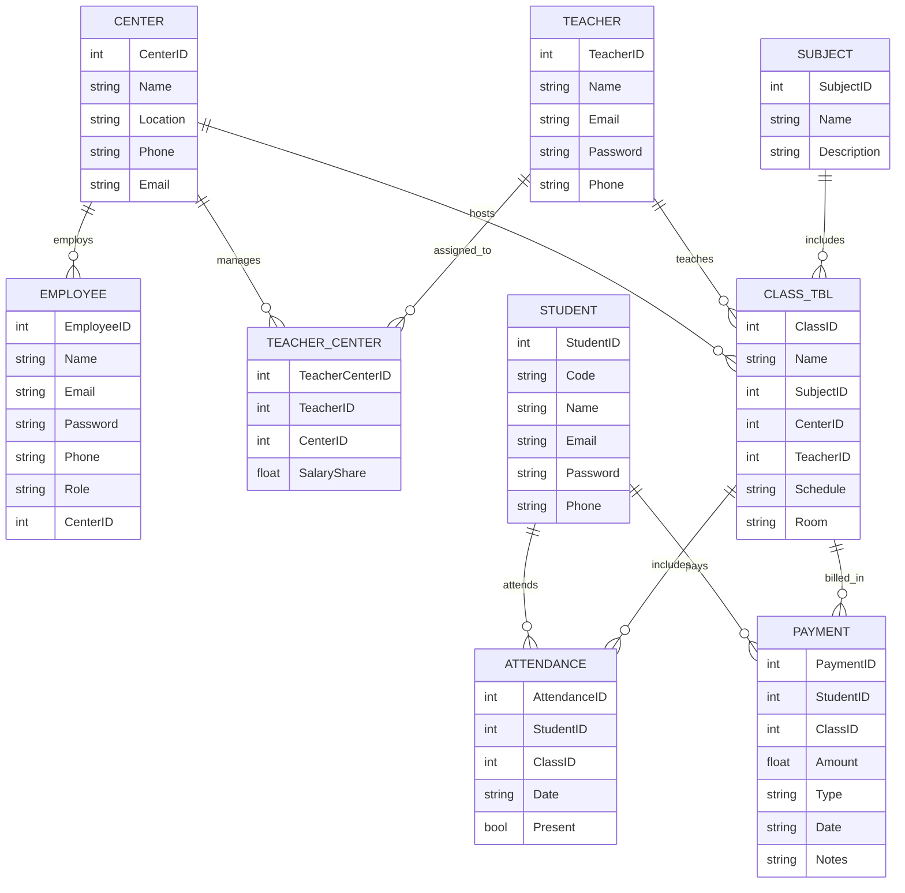

# 🏫 Centers Management ERD

# 🏢 Center
**Attributes**
- CenterID (PK)
- Name
- Location
- Phone
- Email
- ManagerName
- CreatedAt

**Relationships**
- 1 — M → Employee *(Mandatory on Employee)*
- 1 — M → TeacherCenterAccount *(Optional)*
- 1 — M → StudentCenterAccount *(Optional)*
- 1 — M → Classroom *(Mandatory)*
- 1 — M → Class *(Optional)*
- 1 — M → PaymentRecord *(Optional)*

---

# 👤 User (Base Entity)
Represents any system user (Admin, Employee, Teacher, Student).

**Attributes**
- UserID (PK)
- FullName
- Email (Unique)
- Phone
- Username (Unique)
- PasswordHash
- Role (Enum: Admin, Employee, Teacher, Student)
- Status (Active / Inactive)
- CreatedAt
- LastLogin

---

# 👨‍💼 Employee
**Attributes**
- EmployeeID (PK, FK → UserID)
- CenterID (FK)
- NationalID
- HireDate
- Salary
- Position (Reception / Accountant / etc.)

**Relationships**
- M — 1 → Center *(Mandatory)*
- 1 — M → PaymentRecord *(Optional)*
- 1 — M → AttendanceRecord *(Optional)*

---

# 👨‍🏫 Teacher
**Attributes**
- TeacherID (PK, FK → UserID)
- Specialization
- Bio
- NationalID
- HireDate

**Relationships**
- 1 — M → TeacherCenterAccount *(Mandatory)*

---

# 💼 TeacherCenterAccount
Defines a teacher’s relationship and financial link with a specific center.

**Attributes**
- TeacherCenterID (PK)
- TeacherID (FK)
- CenterID (FK)
- CommissionRate
- JoinDate
- Status (Active / Suspended)

**Relationships**
- M — 1 → Teacher *(Mandatory)*
- M — 1 → Center *(Mandatory)*
- 1 — M → Class *(Optional)*
- 1 — M → PaymentRecord *(Optional)*

---

# 👨‍🎓 Student
**Attributes**
- StudentID (PK, FK → UserID)
- Code (Unique across all centers)
- ParentName
- ParentPhone
- BirthDate
- Gender

**Relationships**
- 1 — M → StudentCenterAccount *(Mandatory)*

---

# 🏫 StudentCenterAccount
Represents a student’s presence and payments within a specific center.

**Attributes**
- StudentCenterID (PK)
- StudentID (FK)
- CenterID (FK)
- RegistrationDate
- Status (Active / Suspended)
- Notes

**Relationships**
- M — 1 → Student *(Mandatory)*
- M — 1 → Center *(Mandatory)*
- 1 — M → Enrollment *(Optional)*
- 1 — M → PaymentRecord *(Optional)*
- 1 — M → AttendanceRecord *(Optional)*

---

# 📘 Class
**Attributes**
- ClassID (PK)
- CenterID (FK)
- TeacherCenterID (FK)
- SubjectName
- ScheduleDay
- StartTime
- EndTime
- MonthlyFee
- ClassroomID (FK)
- Status (Active / Archived)

**Relationships**
- M — 1 → Center *(Mandatory)*
- M — 1 → TeacherCenterAccount *(Mandatory)*
- M — 1 → Classroom *(Mandatory)*
- 1 — M → Session *(Optional)*
- 1 — M → Enrollment *(Optional)*

---

# 🧾 Session
**Attributes**
- SessionID (PK)
- ClassID (FK)
- Date
- StartTime
- EndTime
- Topic
- Status (Completed / Canceled)

**Relationships**
- M — 1 → Class *(Mandatory)*
- 1 — M → AttendanceRecord *(Optional)*

---

# 🧍 Enrollment
**Attributes**
- EnrollmentID (PK)
- StudentCenterID (FK)
- ClassID (FK)
- StartDate
- EndDate (nullable)
- Status (Active / Completed / Dropped)

**Relationships**
- M — 1 → StudentCenterAccount *(Mandatory)*
- M — 1 → Class *(Mandatory)*

---

# 🕓 AttendanceRecord
**Attributes**
- AttendanceID (PK)
- StudentCenterID (FK)
- SessionID (FK)
- EmployeeID (FK)
- Status (Present / Absent / Excused)
- RecordedAt

**Relationships**
- M — 1 → StudentCenterAccount *(Mandatory)*
- M — 1 → Session *(Mandatory)*
- M — 1 → Employee *(Mandatory)*

---

# 💰 PaymentRecord
**Attributes**
- PaymentID (PK)
- CenterID (FK)
- EmployeeID (FK)
- StudentCenterID (nullable, FK)
- TeacherCenterID (nullable, FK)
- Amount
- PaymentType (Tuition / Material / Salary / Commission)
- PaymentMethod (Cash / Card / Transfer)
- Description
- PaymentDate

**Relationships**
- M — 1 → Employee *(Mandatory)*
- M — 1 → Center *(Mandatory)*
- M — 1 → StudentCenterAccount *(Optional)*
- M — 1 → TeacherCenterAccount *(Optional)*

---

# 🏛 Classroom
**Attributes**
- ClassroomID (PK)
- CenterID (FK)
- Name
- Capacity
- Floor
- Status (Available / Maintenance)

**Relationships**
- M — 1 → Center *(Mandatory)*
- 1 — M → Class *(Optional)*

