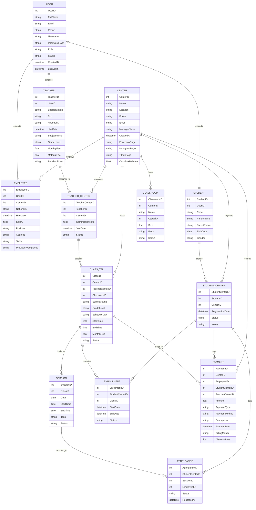

```mermaid
erDiagram
    CENTER {
        int CenterID
        string Name
        string Location
        string Phone
        string Email
        string ManagerName
        datetime CreatedAt
        string FacebookPage
        string InstagramPage
        string TiktokPage
        float CashBoxBalance
    }

    USER {
        int UserID
        string FullName
        string Email
        string Phone
        string Username
        string PasswordHash
        string Role
        string Status
        datetime CreatedAt
        datetime LastLogin
    }

    EMPLOYEE {
        int EmployeeID
        int UserID
        int CenterID
        string NationalID
        datetime HireDate
        float Salary
        string Position
        string Address
        string Skills
        string PreviousWorkplaces
    }

    TEACHER {
        int TeacherID
        int UserID
        string Specialization
        string Bio
        string NationalID
        datetime HireDate
        string SubjectName
        string GradeLevel
        float MonthlyFee
        float MaterialFee
        string FacebookLink
    }

    TEACHER_CENTER {
        int TeacherCenterID
        int TeacherID
        int CenterID
        float CommissionRate
        datetime JoinDate
        string Status
    }

    STUDENT {
        int StudentID
        int UserID
        string Code
        string ParentName
        string ParentPhone
        date BirthDate
        string Gender
    }

    STUDENT_CENTER {
        int StudentCenterID
        int StudentID
        int CenterID
        datetime RegistrationDate
        string Status
        string Notes
    }

    CLASSROOM {
        int ClassroomID
        int CenterID
        string Name
        int Capacity
        float Size
        string Floor
        string Status
    }

    CLASS_TBL {
        int ClassID
        int CenterID
        int TeacherCenterID
        int ClassroomID
        string SubjectName
        string GradeLevel
        string ScheduleDay
        time StartTime
        time EndTime
        float MonthlyFee
        string Status
    }

    SESSION {
        int SessionID
        int ClassID
        date Date
        time StartTime
        time EndTime
        string Topic
        string Status
    }

    ENROLLMENT {
        int EnrollmentID
        int StudentCenterID
        int ClassID
        datetime StartDate
        datetime EndDate
        string Status
    }

    ATTENDANCE {
        int AttendanceID
        int StudentCenterID
        int SessionID
        int EmployeeID
        string Status
        datetime RecordedAt
    }

    PAYMENT {
        int PaymentID
        int CenterID
        int EmployeeID
        int StudentCenterID
        int TeacherCenterID
        float Amount
        string PaymentType
        string PaymentMethod
        string Description
        datetime PaymentDate
        string BillingMonth
        float DiscountRate
    }

    CENTER ||--o{ EMPLOYEE : employs
    CENTER ||--o{ TEACHER_CENTER : manages
    CENTER ||--o{ CLASS_TBL : hosts
    CENTER ||--o{ STUDENT_CENTER : registers
    CENTER ||--o{ PAYMENT : records
    CENTER ||--o{ CLASSROOM : owns

    USER ||--|| EMPLOYEE : extends
    USER ||--|| TEACHER : extends
    USER ||--|| STUDENT : extends

    TEACHER ||--o{ TEACHER_CENTER : assigned_to
    TEACHER_CENTER ||--o{ CLASS_TBL : teaches

    STUDENT ||--o{ STUDENT_CENTER : attends
    STUDENT_CENTER ||--o{ ENROLLMENT : joins
    STUDENT_CENTER ||--o{ ATTENDANCE : logs
    STUDENT_CENTER ||--o{ PAYMENT : pays

    CLASS_TBL ||--o{ SESSION : includes
    CLASS_TBL ||--o{ ENROLLMENT : contains
    CLASS_TBL ||--o{ PAYMENT : billed_in
    SESSION ||--o{ ATTENDANCE : recorded_in
```
    EMPLOYEE ||--o{ PAYMENT : processes
    EMPLOYEE ||--o{ ATTENDANCE : records
